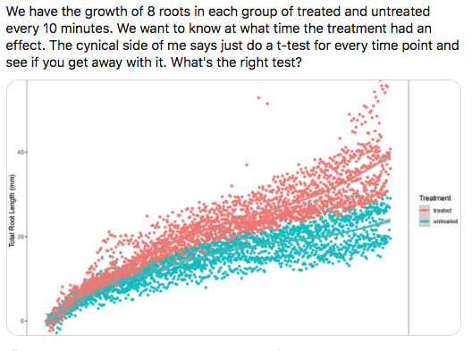

# NHST absurdities

The NHST culture inculcates the view that science asks "is there an effect"-type questions.

1. Is there an effect of invasive plant A on native plant richness?
2. Is there an effect of high-intensity exercise on mitochondrial biogenesis?
3. Is there an effect of cold on adaptive thermogenesis in adipocytes?

Once we pose the question, and devise a response measure (richness, or mitochondrial count, or UCP-1 expression), then we need to figure out the right "test" - a t-test, or ANOVA, or ANCOVA, or Mann-Whitney U, or whatever.

This sort of thinking can absolutely paralyze our ability to frame meaningful scientific questions. Here are examples:

## An example that showed up on my twitter feed

```{r, echo=FALSE}

```

The x-axis of this plot is time in minutes. The y-axis is root length. The two colors are the treatment levels; the control is cyan and the treatment is red. The tweet asks the question "at what time does the treatment have an effect"?

This question makes sense only in an NHST-world. Looking at the graph, at time 0 (left most part), the two colors strongly overlap so it looks like there is "no effect" of treatment. As we move to the right, the overlap is less and less; certainly at the far right there is very little overlap so there appears to be a big treatment effect. In the NHST world, there is some point on the x-axis at which there is "no effect" at shorter times and "an effect" at longer times. The tweeter suggests using a t-test at all values of time and seeing at what time p dips below 0.05.

Ask yourself what we have learned by doing this?

In the real world, this question makes no sense. Roots grow by both cell elongation and cell division. For both, enzymes have to break down links in the cellose in the cell wall so that the wall can be stretched. Whatever the treatment is, it is working on molecules regulating cell division and/or elongation -- maybe its signaling cell division or synthesis of enzymes that break down cellulose links or maybe it directly activates these enzymes. Regardless, this all starts **immediately upon treatment**. The two roots differ immediately, at least at the cell level. Once cells begin to elongate or divide, the root is longer, regardless of weather one can measure a "statistically significant difference in two samples". Say after 10 s, all 8 roots with the treatment are longer by 2 cell lengths but the 8 roots with the control treatment are longer by only 1 cell length. There is "an effect" of treatment immediately, but we can't "find an effect" using a p-value because our measure of root length uses a caliper on the scale of mm instead of a reticule and a microscope on the scale of µm.

Instead of thinking about this as there is "no effect" until time t and then suddenly there is "an effect", we should be asking questions about the magnitude and direction of the effect. Looking at the graph, it looks like treated roots grow alot faster initially and then just a little faster. So lets measure the rate of growth and the change in the rate of growth and compare these and think about what is controlling the rate of growth and variation in the rate, both within treatment level over time, and between treatment levels.

(test)
